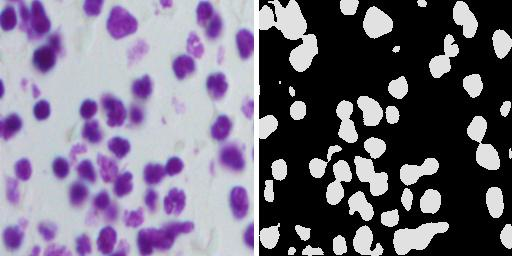

# VariableNeuralNets - attention-based parameter swapping for continual learning
official submission for 2022 AWS Deep Learning Challenge



![[merged_image 1.jpg]]
![[merged_image 2.jpg]]
## Set-up Steps 

0. Set up DL1 Instance / Choose [Habana® Deep Learning Base AMI (Ubuntu 20.04)](https://aws.amazon.com/marketplace/pp/prodview-fw46rwuxrtfse?sr=0-1&ref_=beagle&applicationId=AWSMPContessa) image

1. Select a TensorFlow framework image to run on the above Habana image:
	
> docker pull public.ecr.aws/habanalabs/tensorflow-installer:2.8.0-ubuntu20.04-1.3.0-latest

Run the docker image:

>docker run -it --runtime=habana -e HABANA_VISIBLE_DEVICES=all -e OMPI_MCA_btl_vader_single_copy_mechanism=none --cap-add=sys_nice --net=host --ipc=host public.ecr.aws/habanalabs/tensorflow-installer:2.8.0-ubuntu20.04-1.3.0-latest


## Run the model
Create a working directory for python scripts on EC2 and execute: 
- ```trainUNet.py``` to train the MainNet (UNet) 
- ```AttentionNet.py``` to train the AttentionNet (CNN)
- ```Mechanics.py``` with given input image to test entire model on given task for either brain tumor, colonoscopy, or cell nuclei segmentation


### Datasets
**Nuclei Segmentation:**
https://www.kaggle.com/c/data-science-bowl-2018/overview

**Brain Tumor:**
https://www.med.upenn.edu/cbica/brats2020/data.html

**Colonoscopy:**
https://paperswithcode.com/dataset/kvasir
---
## Documentation
https://docs.habana.ai/en/latest/index.html

Transfer learn a basic image classification model + run it:
https://developer.habana.ai/tutorials/tensorflow/image-classification/
